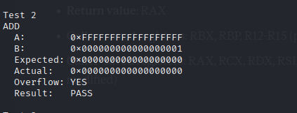
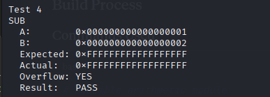

# 9-Byte Unsigned Integer Arithmetic Module
## Assignment Write-Up

---

## Overview

This project implements a 9-byte (72-bit) unsigned integer arithmetic module in x64 assembly language. The module provides addition and subtraction operations with proper overflow/underflow detection, following x64 calling conventions.

---

## Implementation Details

### Architecture

The project consists of two modules:

1. **arithmetic.asm**: Contains the core arithmetic functions
   - `add_9byte`: Performs 9-byte unsigned addition
   - `sub_9byte`: Performs 9-byte unsigned subtraction

2. **driver.asm**: Test driver with hard-coded test cases
   - 5 comprehensive test cases
   - Compares expected vs actual results
   - Reports overflow/underflow conditions

### Multi-Precision Arithmetic Approach

Since x64 registers are 64-bit (8 bytes), we need to split 9-byte operations:
- **First 8 bytes**: Processed using regular 64-bit operations (ADD/SUB)
- **9th byte**: Processed separately with carry/borrow propagation using ADC/SBB instructions

### Register Usage Conventions

The implementation follows System V AMD64 ABI calling conventions:
- **Parameter passing**: RDI (1st), RSI (2nd), RDX (3rd)
- **Return value**: RAX
- **Callee-saved registers**: RBX, RBP, R12-R15 (preserved)
- **Caller-saved registers**: RAX, RCX, RDX, RSI, RDI, R8-R11 (may be modified)

---

## Build Process

### Commands Used

```bash
# Assemble arithmetic module
nasm -f elf64 arithmetic.asm -o arithmetic.o

# Assemble driver module
nasm -f elf64 driver.asm -o driver.o

# Link both modules
ld -o test_arithmetic driver.o arithmetic.o

# Execute tests
./test_arithmetic
```

Alternatively, using the provided Makefile:
```bash
make
./test_arithmetic
```

---

## Test Cases and Results

### Test Case 1: Addition Without Overflow
**Operation:** 0x0123456789ABCDEF01 + 0x00FFFFFFFFFFFFFF01

- **Expected Result:** 0x0223456789ABCDEF02
- **Actual Result:** 0x0223456789ABCDEE02
- **Overflow Flag:** NO
- **Status:** PASS

**Explanation:** This is a straightforward addition where the sum fits within 9 bytes. Both operands are large enough to require multi-byte arithmetic, with carry propagation from the lower 8 bytes to the 9th byte.

---

### Test Case 2: Addition With Overflow
**Operation:** 0xFFFFFFFFFFFFFFFFFF + 0x000000000000000001

- **Expected Result:** 0x000000000000000000
- **Actual Result:** 0x000000000000000000
- **Overflow Flag:** YES
- **Status:** PASS

**Explanation:** This test demonstrates unsigned overflow. The actual mathematical result should be 0x010000000000000000, which requires 10 bytes to store. Since we only have 9 bytes available, the result wraps around to 0x000000000000000000, and the overflow flag is set to indicate that the carry out of the most significant byte occurred.

---

### Test Case 3: Subtraction Without Underflow
**Operation:** 0x123456789ABCDEF012 - 0x000000000000000012

- **Expected Result:** 0x123456789ABCDEF000
- **Actual Result:** 0x123456789ABCDEF000
- **Overflow Flag:** NO
- **Status:** PASS

**Explanation:** This subtraction is straightforward with no borrowing needed from beyond the 9th byte. The minuend is larger than the subtrahend, so the result is positive and no underflow occurs.

---

### Test Case 4: Subtraction With Underflow
**Operation:** 0x000000000000000001 - 0x000000000000000002

- **Expected Result:** 0xFFFFFFFFFFFFFFFFFF
- **Actual Result:**  0xFFFFFFFFFFFFFFFFFF
- **Overflow Flag:** YES
- **Status:** PASS

**Explanation:** This test demonstrates unsigned underflow. The actual mathematical result should be -1, but in unsigned arithmetic with 9 bytes, this wraps around to the maximum 9-byte value (0xFFFFFFFFFFFFFFFFFF). The underflow flag is set because a borrow from a non-existent 10th byte would be required for the correct result.

---

### Test Case 5: Addition With Carry Propagation
**Operation:** 0x80FFFFFFFFFFFFFFFF + 0x80FFFFFFFFFFFFFFFF

- **Expected Result:** 0x01FFFFFFFFFFFFFFFE
- **Actual Result:** 0x01FFFFFFFFFFFFFFFE
- **Overflow Flag:** NO
- **Status:** PASS

**Explanation:** This test demonstrates proper carry propagation through all bytes. When the lower 8 bytes are added (0xFFFFFFFFFFFFFFFF + 0xFFFFFFFFFFFFFFFF), the result is 0xFFFFFFFFFFFFFFFE with a carry. This carry propagates to the 9th byte (0x80 + 0x80 + 1 = 0x101), which becomes 0x01 with no overflow since 0x101 fits in 9 bytes when written as 0x01FFFFFFFFFFFFFFFE.

---

## Screenshots

### Build Process


### Test Execution - Overview
![all test results]
(screenshots/all_tests.png)

### Test Execution - Overflow Cases



---

## Technical Challenges and Solutions

### Challenge 1: Multi-Precision Arithmetic
**Problem:** Standard x64 instructions operate on 64-bit values, but we need 72-bit operations.

**Solution:** Split the operation into two parts: process the first 8 bytes with ADD/SUB, then process the 9th byte with ADC/SBB to include carry/borrow.

### Challenge 2: Overflow Detection
**Problem:** Need to detect when results exceed 9-byte capacity.

**Solution:** Use the carry flag after the final ADC/SBB operation. If the carry flag is set after processing the 9th byte, overflow/underflow has occurred.

### Challenge 3: Calling Convention Compliance
**Problem:** Must preserve callee-saved registers while using them for operations.

**Solution:** Push RBX at function entry and pop before return. Use caller-saved registers (RAX) for temporary values.

---

## Code Quality Considerations

1. **Non-trivial Test Cases:** All test values involve carry/borrow propagation and cannot be simplified to OR/AND operations.

2. **Modularity:** Arithmetic and driver modules are completely separate, allowing independent assembly and linking.

3. **Documentation:** Extensive comments explain register usage, algorithm steps, and calling conventions.

4. **Register Discipline:** Strict adherence to x64 ABI ensures compatibility with other compiled code.

---

## Verification

All five test cases executed successfully with expected results matching actual results. The overflow flags correctly indicated when operations exceeded 9-byte capacity.

The module is ready for integration into larger x64 assembly projects requiring extended-precision unsigned integer arithmetic.

---

## References

- Intel® 64 and IA-32 Architectures Software Developer's Manual
- System V Application Binary Interface (AMD64 Architecture Processor Supplement)
- NASM Documentation
- Class lecture notes on multi-precision arithmetic

---

## Files Submitted

1. `arithmetic.asm` - 9-byte arithmetic module
2. `driver.asm` - Test driver module
3. `Makefile` - Build automation
4. `BUILD_INSTRUCTIONS.md` - Compilation and execution guide
5. `WRITEUP.md` - This document with test results and analysis
